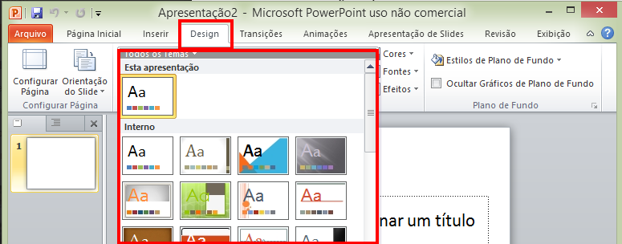
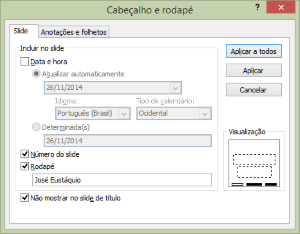
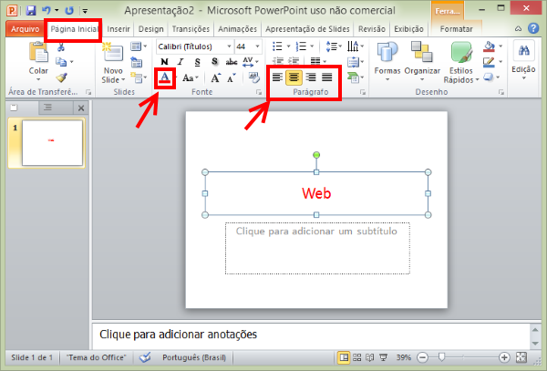
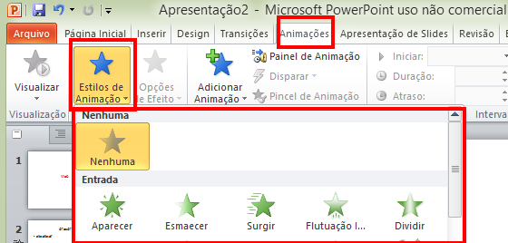
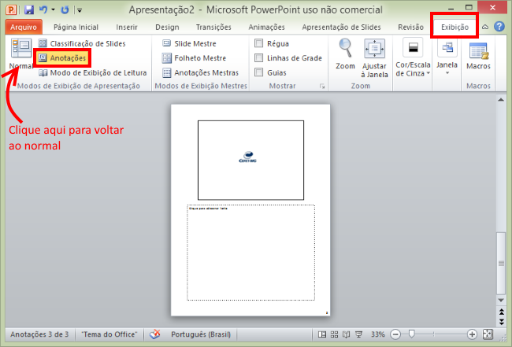

## Guia **24**

- Assunto: **Apresentações**: Powerpoint
- Objetivos:
  1. Orientações de Apresentação de conteúdos
  1. Criação de apresentações
  1. Formatação de slides e conteúdo
  1. Notas de apresentação

---
## Enunciado

- Você vai criar uma apresentação com 9 slides, conforme as orientações
  descritas no restante desta apresentação.
- Mas, primeiro, vejamos algumas recomendações para a criação de apresentações

---
# Orientações de Apresentação de conteúdos

---
## Recomendações

- Preferir utilizar tópicos, e não parágrafos grandes
  - O uso de slides cheios de textos dificulta o acompanhamento da pessoa
    que está assistindo a sua apresentação
- Não usar textos com fontes menores que **24pt**
  - Para que mesmo quem está no fundo da sala consiga enxergar
- Usar um esquema de cores de alto contraste
- Não "poluir" os slides com informação demais

---
# 1º slide

---
## Conteúdo

- **Título**: Internet
- **Corpo**: Autor (seu nome), matrícula, data de hoje

---
# 2º slide

---
## Conteúdo

- Crie um slide de tópicos para o seguinte texto:
  - _“A Internet é uma rede capaz de interligar todos os computadores do mundo.
    O que faz a Internet tão poderosa assim é uma espécie de esperanto da
    informática que atende pelas siglas TCP/IP (Protocolo de Controle de
    Transferência/Protocolo Internet, em inglês). Todos os computadores que
    entendem essa língua são capazes de trocar informações entre si. Assim
    pode-se conectar máquinas de diferentes tipos, como PCs, Macs e Unix”_
- Para isso forneça um título e os tópicos que resumem/descrevem o
  texto informado.

---
## Exemplo de estruturação em tópicos

- **Titulo do slide**: O que é Internet
- Corpo:
  - Rede capaz de interligar os computadores do mundo
  - Baseada na família de protocolos TCP/IP
  - Conecta máquinas de diferentes tipos:
    1. PCs
    1. Macs
    1. Unix

---
# 3º slide

---
## Conteúdo

- Crie um slide de tópicos para o seguinte texto:
  - _“A Internet é organizada na forma de uma malha. Se você pretende acessar
    um computador no Japão, por exemplo, não é necessário fazer um
    interurbano internacional. Basta conectar-se a um computador ligado
    à Internet na sua cidade. Esse computador local está conectado a uma
    máquina em outro estado (ou país) e assim por diante, traçando uma rota
    até chegar ao destino. São máquinas de alta capacidade, com grande poder
    de processamento e conexões velozes, conhecidas como servidores,
    controladas por universidades, empresas e órgãos do governo.”_
- Para isso forneça um título e os tópicos que resumem/descrevem o texto
  informado

---
# 4º slide

---
## Conteúdo

- Busque, na Internet, uma figura que mostre a malha da Internet no mundo e
  inclua-a no slide 4
- Além disso, forneça um título para o slide

---
# 5º slide

---
## Conteúdo

- Dê o título: “Serviços da Internet” e crie um slide de tópicos, listando
  os serviços descritos abaixo:
  - Servidores
  - Web
  - Correio eletrônico
  - Transferência de arquivos

---
# 6º ao 9º slides

- Crie um slide para cada serviço listado no slide anterior. Para cada um,
  apresente o título e o corpo, onde o “corpo”, deve conter uma lista de
  tópicos que resume o serviço que está sendo detalhado

---
## Conteúdo do 6º slide

- **Título**: Servidores
- **Texto para transformação/criação de tópicos**: _Os servidores na Internet
  podem oferecer vários serviços. Copiar arquivos, enviar mensagens
  para outros usuários, participar de grupos de discussão e visitar
  serviços de informação são os principais._

---
## Conteúdo do 7º slide

- **Título**: Web
- **Texto para transformação/criação de tópicos**: _O principal serviço da
  Internet é a Web, a parte multimídia da rede. É na Web que você pode
  ler jornais eletrônicos, fazer compras em shoppings virtuais e
  consultar bancos de dados. É possível ainda saltar de um lugar a outro
  na Internet por meio de páginas interligadas._

---
## Conteúdo do 8º slide

- **Título**: Correio eletrônico
- **Texto para transformação/criação de tópicos**: _Com o correio eletrônico,
  pode-se enviar mensagens para qualquer usuário da rede. O texto chega
  ao destino em alguns minutos (ou horas, dependendo do tráfego) e o usuário
  não precisa estar conectado para receber a carta. A mensagem fica
  armazenada em uma caixa postal eletrônica até que o destinatário resolva
  abrir o envelope digital._

---
## Conteúdo do 9º slide

- **Título**: Transferência de arquivos
- **Texto para transformação/criação de tópicos**: _Com o FTP é possível
  copiar programas gratuitos de servidores da rede. A maioria destes
  servidores está localizada em universidades e contém todos os tipos
  de software. Você pode encontrar desde utilitários anti-vírus, até
  aplicativos completos, como editores de texto._

---
# Parte 2: Estilização

---
## Tema

- Vamos selecionar um tema pronto do Powerpoint para tornar a apresentação
  mais atraente
  - Na aba "Design", escolha um tema da seção "Temas"

    
---
## Número do slide e rodapé

- Vamos inserir o número do slide e seu nome no rodapé de cada slide
  - Na aba "Inserir", na seção "Texto", clique no botão "Cabeçalho e Rodapé"

    
  - Uma janela será aberta para configurar as opções de cabeçalho e rodapé

---
## Número do slide e rodapé

- (continuando da janela de opções de cabeçalho e rodapé)  
  - Selecione "número de slide", "rodapé" e escreva seu nome no campo. Marque,
    também, a opção para ocultar o número no primeiro slide

    

---
## Formatação de texo

- Formate todos os títulos (de todos os slides) com a cor vermelha e centralizado

  

---
## Formatação de texo (cont.)

- Verifique que todos os seus textos obedecem a regra de pelo menos 24pt e os
  corrija, caso necessário
- Além disso, em frases grandes, destaque as partes mais importantes do texto
  de forma que elas chamem mais atenção.
  - Por exemplo:

    _"A Internet é um conjunto de redes interconectadas de **abrangência
      mundial**"_

---
## Transição de slides

- Crie uma transição para os slides e aplique-a para todos eles.
  - Você pode escolher a transição que quiser na aba "Transições" e
    configurá-la quanto a velocidade, tipo de avanço (clique, tempo) e outras
    coisas

    

---
## Animação de conteúdo

- Personalize de alguma forma a animação da figura do slide 4.
  - Por exemplo, você pode fazer com que a figura entre no slide saltitando
    como um pônei.
  - Para isso, selecione a imagem e use a aba "Animações"
    

---
## Animação de conteúdo (cont.)

- 
  (continuando da aba "Animações"...)
  - Clique no botão "Estilos de Animação" e escolha uma **animação
    de entrada**
  - Repare que é possível pré-visualizar o efeito de animação para que fique
    mais fácil escolher um

---
## Notas de apresentação

- Um recurso interessante do Powerpoint é o uso de **anotações de apresentação**
  - Ele permite que você escreva um texto complementar ao slide
  - Esse texto não aparece na apresentação, mas pode aparecer quando você
    mandar imprimir, por exemplo
- Para incluir essas notas:
  1. Vá até a aba "Exibição" e, na seção "Modos de Exibição de Apresentação",
     selecione "Anotações" (veja figura no próximo slide)
  1. Para este exercício, você deve colocar os textos completos que você
     transformou em tópicos em seu respectivo slide

---
## Notas de apresentação (cont.)

---
## Visualização

- Para visualizar como ficou sua apresentação, você deve entrar no modo de
  apresentação. Você pode fazer isso de duas formas:
  1. Desde o primeiro slide
    - Opção 1:

      
    - Opção 2: tecla `F5`
  1. À partir do slide atual

---
## Visualização (cont.)

- (continuando visualização à partir do slide atual...)
  - Opção 1:

    
  - Opção 2: teclas `Shift+F5`
  - Opção 3:

    

---
## Finalizando...

1. Salvar como guia-powerpoint-1.pptx (formato de arquivo padrão do Powerpoint)
1. Entregar **via Moodle** no horário **desta aula**
