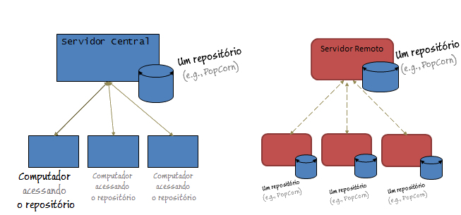
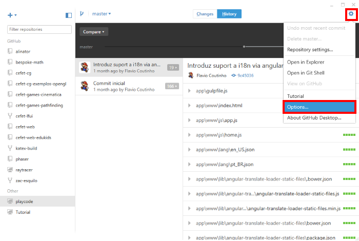
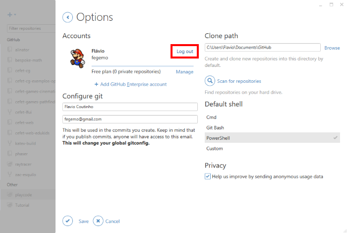
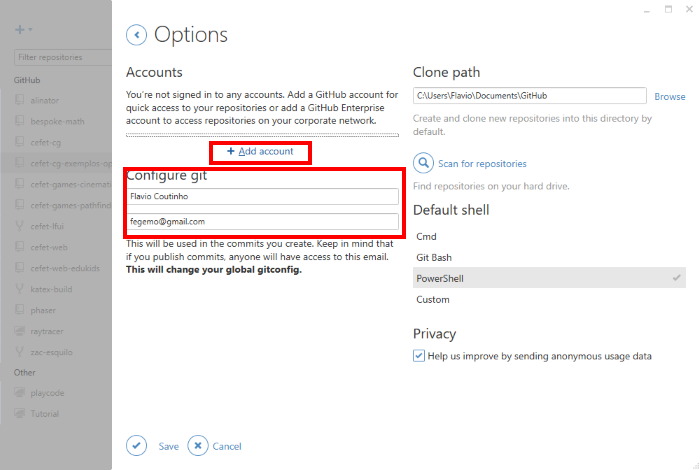
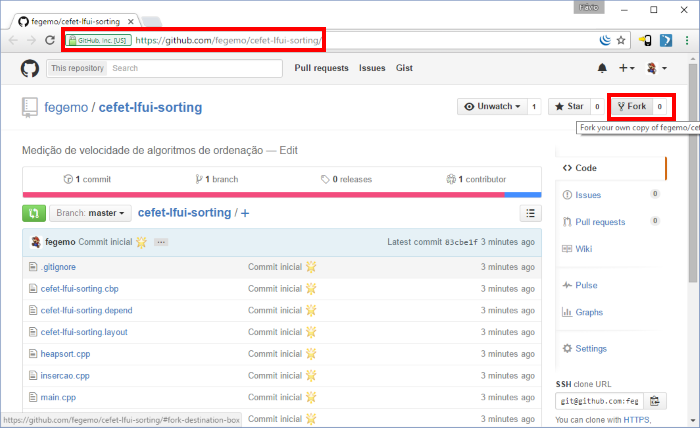
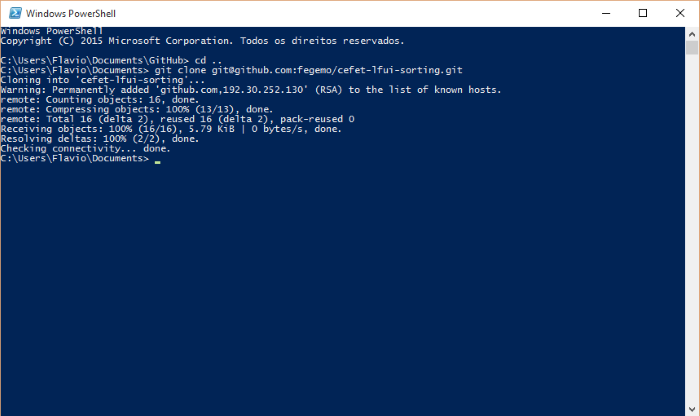
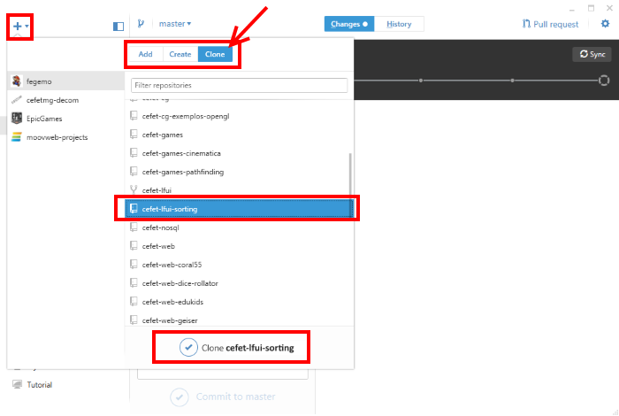
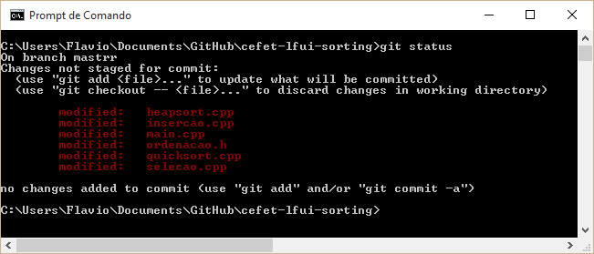
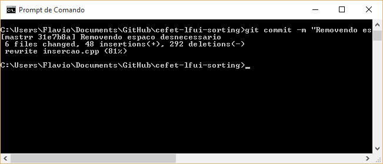
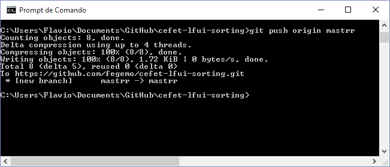

## Guia **Git**

- Assunto: Sistemas de Controle de Versão (<abbr title="Control Version System">CVS</abbr>)
- Objetivos:
  1. Entender para que serve um <abbr title="Control Version System">CVS</abbr>
  1. Conhecer CVSs centralizados e distribuídos
  1. Praticar Git criando um repositório
  1. Usar o serviço de hospedagem de repositórios GitHub

---
# O que é **Sistema de Controle de Versão**

- Controle de Versão: um sistema para gerenciar alterações feitas a documentos
  e outros tipos de arquivos
- Que tipos de arquivos?
  - Código fonte (principalmente)
  - Documentação
  - Arquivos binários (música, imagens etc.)
- Por que usar?
  - Manter um histórico de alterações no código
    - Forma de _backup_
    - Forma de "voltar a um ponto no tempo"
  - Colaborar - várias pessoas trabalhando no mesmo trecho de código
    ao mesmo tempo

---
# O que é **Sistema de Controle de Versão** (2)

- Há vários VCSs famosos disponíveis:
  - CVS
  - SVN
  - SourceSafe
  - Mercurial
  - **Git**
- Cada "projeto" é armazenado separadamente em um "recipiente" chamado
  **repositório**
- Há 2 tipos de VCS:
  - Centralizado
  - Distribuído (tipo do git)

---
## VCS Centralizado _vs_ Distribuído



---
## VCS Centralizado _vs_ Distribuído


---
## Enunciado

- Em linhas gerais, vamos:
  - Primeiramente, [crie uma conta no GitHub](http://github.com) caso ainda
    não tenha uma (<u>Exercício 0</u>)
  - Em seguida, você vai **configurar o programa gráfico do GitHub** para
    usar seu usuário (<u>Exercício 1</u>)
  - Posteriormente, você **usará um projeto de código C++** do professor e fazer
    umas **alterações marotas** nele (<u>Exercício 2</u>)
  - Por fim, você **enviará suas melhorias** do código para o professor
    (<u>Exercício 3</u>)
- Os próximos slides mostram os passos para os exercícios...
- Ao longo dos exercícios, algumas explicações serão dadas

---
# Exercícios 0 e 1

- Se ainda não tiver uma conta no GitHub, [crie uma agora](https://github.com/)
- Se o programa do GitHub não estiver instalado, [instale-o](https://desktop.github.com/)
- Se ele já estava instalado, possivelmente estava configurado para usar o
  usuário de outrem
  - Nesse caso, **você precisa usar suas credenciais** para usar o GitHub em
    seu próprio nome
  - Para fazer isto, veja os passos nas imagens dos próximos slides...

---
## Configurando o GitHub para usar seu usuário (1)



---
## Configurando o GitHub para usar seu usuário (2)



---
## Configurando o GitHub para usar seu usuário (3)



---
<!--
  backdrop: detour
-->

# Git _vs_ GitHub

- Definição:
  - O **Git** é um sistema (**programa**) de controle de versão
  - O **GitHub** é uma **empresa que presta um serviço** de hospedagem de
    repositórios Git
- Natureza:
  - O **Git é totalmente gratuito**, com licença de código aberto
  - O **GitHub tem planos gratuitos**. Para projetos "públicos" (de código aberto),
    o GitHub nos permite hospedar o repositório gratuitamente
    - Se quisermos um **repositório privado, precisamos pagar**

---
<!--
  backdrop: detour
-->

# Git _vs_ GitHub (2)

- Quando surgiu:
  - Git: 2005, criado pelo Linus Torvalds
  - GitHub: 2008, criado por 3 carinhas para fomentar sistemas de código aberto
- Objetivos:
  - Git: **gerenciar e compartilhar código** entre membros de uma equipe
  - GitHub: **hospedar** repositórios Git
- 
  
  Logomarcas:


---
<!--
  backdrop: detour
-->

# Git _vs_ GitHub (3)

- Posso usar Git sem usar GitHub?
  - Sim! Inclusive, existem outros serviços concorrentes:
    - [Bitbucket.org](https://bitbucket.org/)
    - [Gitlab](https://about.gitlab.com/) etc.
- Posso usar GitHub sem usar Git?
  - Até pode hoje em dia, ~~porque posteriormente o GitHub passou a aceitar repositórios SVN,~~
    mas o GitHub apenas hospeda (armazena) os repositórios

---
# Exercício 2

- <p class="note" style="float:right; width:40%;">
  **_Fork_** é um conceito do GitHub, que significa: pegar um repositório de
  outra pessoa e criar um idêntico pra mim.
  </p>
  Agora, vamos fazer um _fork_ (bifurcar) de um repositório do professor que
  contém um programinha C++ com algoritmos de ordenação
  - O nome desse repositório é `cefet-lfui-sorting` e o endereço dele
    no GitHub é [`http://github.com/fegemo/cefet-lfui-sorting`](http://github.com/fegemo/cefet-lfui-sorting)
- Para fazer o _fork_, vá até a página do repositório no GitHub e clique no
  botão _fork_
  - Veja no próximo slide

---
## Fazendo o _fork_ do repositório do professor



---
## Exercício 2

- Com a bifurcação (_fork_) feita, você já pode ver que possui sua cópia
  do repositório do professor (`cefet-lfui-sorting`) no GitHub ao visitar
  sua página: [http://github.com/SEU_USUARIO/cefet-lfui-sorting](http://github.com/SEU_USUARIO/cefet-lfui-sorting)
  - No entanto, agora você precisa trazer essa cópia para o computador
    que está usando agora
  - <p class="note" style="float: right; width: 28%">
    Clonar o repositório é um conceito do Git
    </p>
    Dizemos que você vai **clonar o repositório**
- Você pode clonar um repositório usando a (1) linha de comando
  ou (2) a interface gráfica
  1. Abra o programa `git shell` e execute:
    ```bash
    git clone git@github.com:SEU_USUARIO/cefet-lfui-sorting.git
    ```
  2. Abra o programa `github` e adicione um repositório clonado (próximo slide)

---
## **Clonando** um repositório usando a <u>**linha de comando**</u>



---
## **Clonando** um repositório usando a <u>**interface gráfica**</u>



---
## Exercício 2 (continuando)

- Com o repositório clonado, agora o código fonte do professor está
  em seu computador (_e.g._, `C:\Usuarios\Aluno\Documentos\GitHub\cefet-lfui-sorting`)
- Agora, você deve:
  1. Abrir o projeto do CodeBlocks e executar o programa
    - Pode durar entre 10-30 segundos para o programa terminar
    - Ele está ordenando um vetor de 100.000 elementos usando o algoritmo
      de seleção
    - Nos próximos passos, você deve fazer umas alterações no código e
      registrá-las... Continue lendo!

---
## Exercício 2 (alterando o código)

- Você deve:
  1. Alterar o código para remover o espaçamento vertical extra de todos os
    arquivos (linhas em branco estranhas)
    - Teste o programa novamente para ver que está tudo ok
  2. "Registrar" essas alterações, criando um ponto no histórico do repositório
    - A isso damos o nome de **fazer um _commit_**
      <p class="note">
        Um _commit_ é um "ponto salvo no histórico". É como se estivéssimos
        anotando, em um caderno, uma linha descrevendo as alterações que estão
        sendo feitas ao conteúdo do repositório (_i.e._, ao código fonte).
      </p>
    - (continua...)

---
## Exercício 2 (alterando o código)

- Para fazê-lo, você vai usar os dois comandos a seguir, **<u>mas não utilize-os ainda</u>**:
  ```bash
  git add -A
  git commit -m "Removendo espaço desnecessário"
  ```

---
<!--
  backdrop: detour
-->

## Visualizando a situação

- Antes de fazer o _commit_, verifique como está a situação - que arquivos
  alterados, excluídos ou adicionados - usando `git status`:
  ```bash
  git status
  ```
  - Resultado:
    

---
<!--
  backdrop: detour
-->

## Visualizando a situação

- Repare que todos os arquivos aparecem de vermelho, informando que eles
  foram modificados
- Agora, precisamos falar que alterações queremos salvar no histórico
  (_i.e._, "commitar"):
  ```bash
  git add -A
  ```
  - `git add -A` diz que todos os arquivos serão salvos (`-A` é `--all`, ou todos)
  - Dê outro `git status` agora e repare os arquivos agora estão "marcados
    para serem salvos"

---
<!--
  backdrop: detour
-->

## Fazendo o _commit_

- Neste ponto, você pode pegar esse conjunto de alterações e efetivamente
  salvá-las no histórico, fazendo um _commit_:
  ```bash
  git commit -m "Removendo espaço desnecessário"
  ```
  - O argumento `-m "..."` é um texto que descreve o que essas alterações
    estão fazendo
  

---
## Exercício 2 (verificando histórico de _commits_)

- Continuando:
  1. Para ver que deu certo, você pode visualizar o **_log_ de
    _commits_**:
    ```bash
    git log
    ```
    - Repare que existem outros _commits_, que foram feitos antes deste, pelo
      próprio professor
  1. Agora, você deve alterar o código (`main.cpp:Ordenar()`) para usar o
    _heapsort_ em vez do algoritmo de seleção
    - Teste para ver se está tudo certo (repare que foi bem mais rápido para ordenar)
    - Agora faça novo _commit_ com essas alterações, repetindo os passos
      que fez da primeira vez
      - Coloque uma mensagem descritiva no _commit_

---
## Exercício **3**: enviando _commits_ ao GitHub

- Agora que você fez 2 _commits_, eles estão salvos no repositório que está
  no seu computador
  - Mas queremos também enviá-los ao repositório que está hospedado no GitHub
  - Assim, outras pessoas podem trabalhar em cima das alterações que você fez
  - E você ganha um _backup_ caso seu computador frite
- O comando `git push` envia ("empurra") os _commits_ para o servidor remoto
  (no caso, o GitHub):
  ```bash
  git push origin master
  ```

---
## Exercício 3 (cont.)

- O resultado no terminal deve ser parecido com:




---
## Finalizando...

1. Envie, no Moodle, a URL para seu repositório
1. Isso deve ser feito no horário **desta aula**
