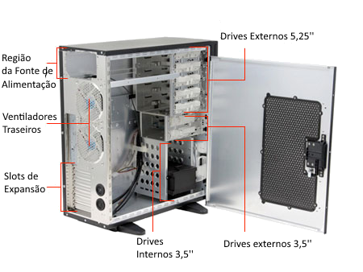
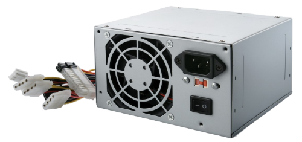
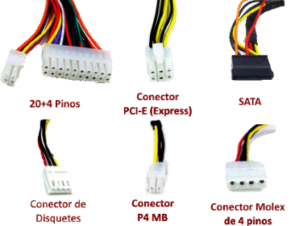
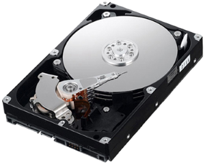
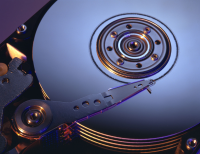
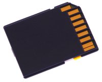
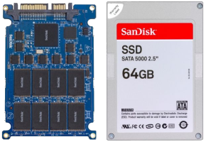

## Guia Hardware: **Componentes de Armazenamento e Outros**

- Assunto: Componentes de armazenamento e outros
- Objetivo:
  1. Conhecer as formas de armazenamento de dados
  1. Conhecer a comunicação entre componentes

---
# Arquitetura de um computador

- As peças que compõem um computador podem ser divididas em 3 grupos:
  1. Dispositivos de **entrada**
  1. Dispositivos de **processamento**
  1. Dispositivos de **saída**

---
# O Gabinete

---
## O Gabinete (Chassis ou unidade de sistema)

- Normalmente feito de **aço ou alumínio**, serve para encapsular a maior parte
  dos componentes de um computador
- Seu tamanho varia de acordo com o **fator de forma**:
  - AT (1984): 30,5cm x 33cm
  - ATX (1996): 30,5cm x 24,4cm
    - Este é o fator de forma usado na maior parte dos computadores pessoais
      _desktop_
  - MicroATX (1996): 24,4cm x 24,4cm

---
# Fonte de alimentação

---
## Fonte de alimentação

- Responsável pelo **fornecimento de energia elétrica** aos componentes
- Converte a corrente elétrica alternada ("da tomada") para contínua (como
  se fosse uma bateria)
  - Reduz a tensão de 110/220V para 5-12V (Volts)
- O tipo de fonte usada em computadores é a **chaveada** (_vs._ linear)
  - Ela é mais eficiente, mais leve e gera menos calor

---
## Conectores da fonte

- 
  Da fonte, saem cabos de energia com diferentes tensões que devem ser ligados
  aos diversos componentes do computador

  <ul class="multi-column-list-3">
    <li>Placa mãe</li>
    <li>Drive de disquete</li>
    <li>Placa de vídeo</li>
    <li>Processador</li>
    <li>Disco rígido</li>
    <li>Drives (DVD etc.)</li>
  </ul>

---
# Memória Primária

---
## A tecnologia da **RAM** e da **ROM**

- A memória primária é aquela de apoio ao processador
- Elas são feitas de um material semicondutor (o silício)
  - Composta por milhões de minúsculos circuitos (percursos para a corrente elétrica)
  - Cada circuito pode estar conduzindo eletricidade ou não
    - Com isso, representa-se 0s e 1s e armazena-se números binários
- <abbr title="Random Access Memory">RAM</abbr>: memória de acesso aleatório
- <abbr title="Read-Only Memory">ROM</abbr>: memória somente de leitura
  - Veja detalhes a seguir

---
## Tipos de RAM

- A RAM pode ser de dois tipos
  1. Estática (**SRAM**)
    - Mantém os dados, contanto que haja eletricidade
    - Mais rápida
    - Mais cara
  1. Dinâmica (**DRAM**)
    - Perde os dados caso o processador não os renove
    - Mais lenta
    - Menor (ocupa menos espaço)
    - Muito mais barata (**é a que usamos**)

---
## Montagem das placas de circuito RAM

- <abbr title="Single In-line Memory Module">**SIMM**</abbr>
  - Os pinos de conexão formam um único conjunto de contatos
- <abbr title="Dual In-line Memory Module">**DIMM**</abbr>
  - Os pinos de conexão formam dois conjuntos de contatos
  - Agiliza a transferência de dados
    - Mais dados podem sair/entrar da memória ao mesmo tempo
  - É o que usamos hoje em dia

---
## ROM

- Não volátil
- Contém programas e dados "de fábrica" registrados permanentemente
  - Eles podem ser lidos e usados, mas a memória não pode ser reescrita
- Exemplo:
  - A rotina de inicialização do computador (_boot_) fica armazenada na ROM

---
# Memória Secundária

---
## Disco Rígido (_HD_, ou _hard disk_)

- Representam os dados como **pontos magnetizados** na superfície de um disco
  que gira
  - Um ponto magnetizado representa 1 e ausência de magnetização representa 0
- "Ler" dados do disco implica em converter os pontos (magnetizados ou não)
  em impulsos elétricos que podem ser enviados ao processador
- A **leitura** é feita de forma **sequencial** - para se ler algo que foi
  escrito "no fim" do disco, deve-se **percorrer o caminho até chegar lá**
  - Diferentemente, a R**A**M permite o acesso a qualquer ponto (**A** leatório)
    com a mesma velocidade

---
## Funcionamento do HD

- Em vez de 1 disco, o HD é composto por uma pilha deles
- Um braço (para cada disco) lê ou escreve as informações, movimentando-se mais
  para o centro ou para a ponta do disco

---
## Memória Flash

- Memória semi-condutora, não volátil
- Surgiu como armazenamento secundário de câmeras e dispositivos móveis (celular, PDA etc.)
  - Acesso muito mais rápido do que em discos rígidos
  - O preço por byte ainda é bem mais caro que nos discos rígidos

---
# Placa mãe

---
## Visão Geral da Placa Mãe

- Pode ser entendida em 3 partes:
  1. **Chipsets** de controle (_north/south bridge_)
    - Gerenciam a comunicação entre componentes
  1. **Barramento de sistema**
    - Fios que conectam os componentes (por onde os dados são transferidos)
  1. **Barramentos** (ou _slots_ - espaços reservados) para **expansão**
    - Por onde podem ser conectados novos componentes, para assimilar novas funcionalidades
      ao computador

---
## **Barramento do sistema**

- Em inglês, barramento é _bus_ (ônibus)
  - É o **meio de transporte** de todos os dados trafegando entre a memória principal
    e o processador
- Formado por um conjunto de percursos elétricos (fios) paralelos
  - Geralmente, feitos por um revestimento de cobre na superfície da placa mãe
- A **largura do barramento** define a quantidade de dados que pode ser trafegada por vez (ciclo de clock)

---
# Exercícios no **Moodle**
