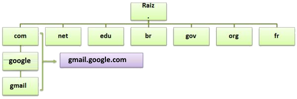
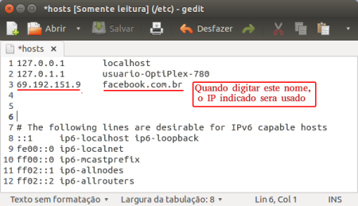

## Guia Internet 2

- Assunto: **Segurança da Informação**
- Objetivos:
  1. Conhecer os fundamentos de Segurança da Informação
  1. Entender a **resolução de DNS local** (arquivo _hosts_)
  1. Prevenção, detecção e mitigação de **malware**

---
## Roteiro

1. Avisos
1. Segurança e DNS
1. Atividades sobre _malware_
   <marquee>ENTREGA DE EXERCÍCIO via Moodle</marquee>

---
# Parte 1: Avisos

---
## Formato de entrega dos trabalhos

Você deve entregar suas atividades desta disciplina, a partir de hoje, seguindo
os formatos descritos a seguir:
1. Seu trabalho deve ser escrito no programa **Word** ou em sua versão software
   livre **LibreOffice Writer**.
1. O trabalho deve ser **entregue no <u>formato pdf</u>**

---
## Formato de entraga dos trabalhos

- Você deve escrever respostas aos enunciados dos exercícios como um
  **texto completo**, da mesma forma que você o faz nas aulas de Português.
- Uma resposta em texto completo deve possibilitar um leitor que tem acesso
   apenas à resposta de saber com facilidade o que foi perguntado.

---
## Exemplo

Questão 1) O que é DDoS?

Formato correto: No contexto de segurança da informação, _Distributed Denial of Services_
(DDoS) ou Negação de Serviços Distribuída refere-se a um ataque cibernético para
impedir que serviços de rede atendam requisições legítimas.

~~Formato incorreto~~: Ataque cibernético para impedir que serviços atendam requisições
legítimas.

---
# Parte 2: Fundamentos de Segurança da Informação

---
## Conheça o **CID** da Segurança

---
## Conheça o **CID** da Segurança

A segurança da informação perpassa por 3 grandes pilares:

- **Confidencialidade** (_confidentiality_): a informação **não deve ser acessada**
  por quem **não tem autorização** para acessá-la.
- **Integridade** (_integrity_): as informações devem estar **sempre corretas** e no **formato esperado**.
- **Disponibilidade** (_availability_): garantia de que **acessos legítimos** à
  informação **são sempre possíveis**.

---
## Os 10 Mandamentos da Segurança da Informação

1. Utilize senhas difíceis de serem descobertas;
2. Altere sua senha periodicamente;
3. Tome cuidado com downloads;
4. Tome cuidado com e-mails de remetentes desconhecidos;
5. Evite sites com conteúdos duvidosos;

---
## Os 10 Mandamentos da Segurança da Informação (cont.)

6. Não abra anexos de e-mails desconhecidos;
7. Tome cuidado com compras na Internet;
8. Tome cuidado ao acessar sites de bancos;
9. Não revele informações sobre você na Internet;
10. Ao informar dados em sites, verifique se a página é segura (com prefixo “https”).

---
## Em destaque: **Utilize senhas difíceis**

- [As 25 senhas mais usadas](http://olhardigital.uol.com.br/fique_seguro/noticia/lista-revela-as-25-senhas-mais-usadas-na-web/46332)
  na Internet em 2014 (América do Norte e Europa Ocidental) - as mais usadas primeiro:
<ul class="multi-column-list-3">
1. **123456**    
2. **password**  
3. 12345  
4. 12345678  
5. **qwerty**   
6. 1234567890 
7. 1234  
8. baseball  
9. dragon  
10. football   
11. 1234567   
12. **monkey** (!!!)   
13. letmein   
14. abc123   
15. 111111   
16. mustang   
17. access   
18. shadow  
19. master   
20. michael  
21. superman   
22. 696969   
23. 123123   
24. batman   
25. trustno1  
</ul>

---
# Parte 3: _Domain Name System_ (DNS)

---
## Qual o problema?

- Computadores são identificados na rede por um endereço IP
- Servidores de sites na Internet são computadores que ficam ligados 24/7 e
  possuem os arquivos dos sites (.html, .js, .css etc.) em um diretório especial
  - Um servidor de sites precisa estar sempre conectado à Internet e deve possuir
    um IP público
- Para acessar um site, podemos simplesmente digitar o IP do seu servidor em
  um navegador (Chrome, Firefox, <abbr title="Internet Explorer">IE</abbr>)
- Contudo, **ninguém quer precisar decorar os endereços IP para acessar sites**
  - Assim, precisamos de alguma **forma de mapear "nomes" (_e.g._, www.google.com)
    de sites em endereços IP**

---
## Servidor de DNS

- Os serviços de DNS (_Domain Name System_) da Internet são **grandes bancos de dados
  espalhados em servidores localizados em várias partes mundo**
- Assim que o nome de um site é digitado no navegador, o computador solicita ao
  **servidor de DNS do provedor de acesso** (_e.g._, GVT) para encontrar qual o endereço
  IP do servidor desse site
  - Caso o servidor DNS do provedor não saiba, ele se comunica a um próximo servidor que
    possa saber qual é o IP do site solicitado
    - Isso tem o nome de **resolução de DNS**

---
## Resolução de DNS

- Veja a explicação no próximo slide

---
## Resolução de DNS

- Há vários servidores DNS no mundo e eles possuem uma hierarquia
  - O maior deles é o servidor **Raiz**, que conhece apenas os outros servidores logo abaixo dele
  - Depois vêm aqueles que conhecem os endereços que terminam com `.br, .fr, .jp, .eu` etc.
    Estes, por sua vez, conhecem outros servidores que vêm logo abaixo:
  - Depois vêm aqueles que conhecem os endereços `.org, .com, .net, .art, .edu` etc.
  - Por último vêm os servidores que conhecem os nomes de sites

---
## Resolução local

- O sistema operacional, seja ele qual for, antes de tentar resolver DNS
  perguntando ao servidor do provedor de acesso, olha para um arquivo dentro
  do próprio computador que contém mapeamento de nomes para endereços IP
  - A isso, dá-se o nome de **resolução <u>local</u> de DNS**
  - 
    O nome desse arquivo é _**hosts**_

---
## O arquivo _hosts_

Um mapeamento de nomes (_Domain Names_) para endereços IP que é a primeira fonte
de pesquisa do sistema operacional para a resolução de DNS.

Localização:
- Windows: `C:\Windows\system32\drivers\etc\hosts`
- Unix: `/etc/hosts`

---
## Exercício (sem entrega)

1. Você deve **localizar o arquivo _hosts_** e **criar uma entrada nele** para
   que o nome "fessor" (sem àspas) aponte para o endereço IP do _notebook_ do professor
2. Acessar, no seu navegador, o computador do professor na porta 8081
  - Ou seja, entrar em http://fessor:8081/

---
<!--
backdrop: bitten
-->

O cachorro do professor comeu este slide.

---
<!--
backdrop: bitten2
-->

Este também...

---
<!--
backdrop: bitten3
-->

...e mais outro...

---
<!--
backdrop: bitten4
-->

...

---
...e agora? Acho que a resposta está em outro lugar... Que tal voltar para os
slides 20 e 21?
