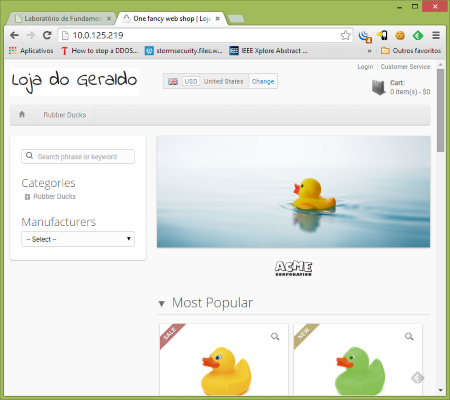

# Você terminou o primeiro exercício!!

O arquivo _hosts_ pode ser usado para
que possamos referenciar outras máquinas da rede através de nomes, em vez de
IPs.

Da mesma forma, um vírus pode alterar seu arquivo _hosts_ com o intuito de
redirecioná-lo ao IP de um site malicioso quando utiliza-se de um nome legítimo
(por ex., acessando-se www.itau.com.br apontando para um site que contém um
vírus ou mesmo uma fachada falsa do itaú para roubar sua senha do banco).

---
# Parte 4: Protocolo HTTP
---
## HTTP

- Modelo de requisição e resposta (_request/response_)
- **GET**: **Baixar um recurso** (por ex., uma página ou uma imagem)
- **POST**: **Enviar dados** (por ex., _upload_ de um arquivo, os dados de um
  formulário)
- HEAD: Baixar apenas oscabeçalhos de uma resposta a uma requisição GET
- DELETE: Excluir um recurso
- CONNECT: Iniciar conexão via _Web Socket_

---
## HTTP

Toda vez que acessamos uma página, por exemplo, http://www.uol.com.br, o
**navegador faz uma requisição HTTP GET** como a seguir:

```
GET / HTTP/1.1
Host: www.uol.com.br
Connection: keep-alive
Accept: text/html,application/xhtml+xml,...
User-Agent: Mozilla/5.0 (Windows NT 6.3;...
Accept-Encoding: gzip,deflate,sdch
Accept-Language: en-US,pt-BR;q=0.8,en;q=0.6
```

---
## HTTP

...e o servidor (no caso, da UOL), responde com:

```
HTTP/1.1 200 OK
Date: Wed, 24 Sep 2014 05:56:22 GMT
Server: marrakesh 1.9.4
Content-Type: text/html
Cache-Control: no-store, private, proxy-revalidate
Vary: Accept-Encoding,User-Agent
Content-Encoding: gzip
Pragma: no-cache
Connection: close
Transfer-Encoding: chunked

&lt;!doctype html&gt;
&lt;html&gt;
...
```

---
## HTTP

Similarmente, quando clicamos em um **botão que vai enviar um formulário**,
o navegador também envia uma requisição para o servidor, **porém do tipo POST**.
Exemplo, no cadastro do twitter:

```
POST /cefet-lfui/registrar HTTP/1.1
Host: fegemo.github.io
User-Agent: HTTPTool/1.0
Content-Type: application/x-www-form-urlencoded
Content-Length: 59

nome=Flavio&email=coutinho@decom.cefetmg.br&senha=lalalalal
```

---
A informação enviada (nome=Flavio....) não aparece em lugar nenhum.

Mas e se pudermos **alterar seus valores** para o que quisermos?

---
## Exercício (para entregar)

Responda esta e as questões seguintes considerando o formato esperado para
suas respostas que conversamos mais cedo.

**Questão 1)** Qual é a tradução de "Tamper Data" (inglês) para o Português?

---
# Parte 4: Hackeando a loja do Geraldo
---
## Loja do Geraldo


---
## Atividade

1. Abrir (ou instalar, se necessário) o Firefox
1. Procurar e instalar uma extensão chamada "Tamper Data"
1. Adicionar nova entrada no _hosts_ para a máquina virtual do professor
   (fessor2) - peça o IP da máquina virtual para o professor
1. Abrir a "loja do Geraldão" (http://fessor2/)

---
## Atividade (continuação)

1. Adicionar um produto ao carrinho
1. Ir até a página do carrinho de compras (link no topo direito da página)
1. Utilizar o "Tamper Data" e alterar o preço do produto
1. Preencher dados fictícios do comprador
1. Selecionar forma de pagamento PayPal
1. Clicar para finalizar a compra...

   Note que, na página que se segue (do PayPal), o preço a ser pago está diferente
   do preço total que deveria ser pago.

---
## Exercício (para entregar)

**Questão 2)** Quais componentes da segurança da informação (CID) estamos quebrando
com este tipo de ataque?

**Questão 3)** Como evitar este tipo de ataque neste caso particular da loja do
Geraldo?

---
# Parte 5: Derrubando a loja do Geraldo
---
## Atividade

Vamos nos organizar e fazer um ataque para tirar a loja do Geraldo do ar.

1. Instalar o software [SwitchBlade](http://www.proactiverisk.com/HttpDosTool4.0.zip?attredirects=0)
1. Realizar um ataque coordenado (com os colegas) à máquina virtual do professor
1. Tentar acessar a loja do Geraldo

---
## Exercício (para entregar)

**Questão 4)** Quais componentes da segurança da informação (CID) estamos quebrando
com um ataque de DDoS?

**Questão 5)** Sendo um técnico de rede da loja do Geraldo, como você mitigaria
este ataque de DDoS?

**Questão 6)** Qual o significado de _honey pot_ (ou pote de mel) no contexto de
segurança da informação.

continua...

---
## Exercício (para entregar)

**Questão 7)** Sendo um hacker tentando derrubar um site usando esse mesmo método,
você poderia ser descoberto de alguma forma? Como?

Entregar via **Moodle**

[Link para entrega](http://moodle.cefetmg.br/mod/assignment/view.php?id=13128)

---
# Parte 6: Para aprender mais...
---
## Referências

- [Projeto OWASP](https://www.owasp.org/index.php/Main_Page)
- [Cartilha de Segurança](http://cartilha.cert.br/)
