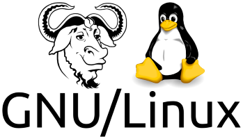
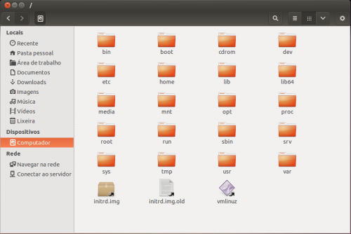

## Guia 13

- Assunto: **O Linux**
- Objetivo:
  1. Conhecer a história do sistema operacional
  1. Conhecer a organização de pastas do Linux
  1. Conhecer e exercitar os comandos _shell_ no Linux

---
# A história

---
## Richard Stallman

<figure class="portrait right">
  
</figure>

- Em 1984, um programador chamado **Richard Stallman** decide criar um sistema operacional em que qualquer
  pessoa poderia **copiar, usar, modificar e distribuir**
  - Na época, Richard contribuía com pesquisas no laboratório de inteligência artificial do MIT
    (_Massachusetts Institute of Technology_)

---


- Em 1985, Richard Stallman fundou a _Free Software Foundation_ (fundação de _software_ livre)
  - Sem fins lucrativos, voltada ao desenvolvimento de _software_ livre
- 
  Em contraposição ao Unix, cujo código era fechado, a fundação desenvolveu o projeto <abbr title="GNU is not Unix">GNU</abbr>
  - O GNU é um sistema operacional cuja idéia é ser completamente aberto e gratuito
  - O problema é que ainda faltava a parte mais importante de um SO: o **_kernel_**

---
# Linus Torvalds

<figure class="portrait right">
  
</figure>

- Em 1991, **Linus Torvalds**, então estudante de matemática na Universidade de Helsinki (Finlândia), desenvolveu
  o Linux (Linus + Unix)
  - Linus se baseou no trabalho de **Andrew Tanenbaum**, que desenvolveu o Minix - um mini sistema operacional com
    objetivo de ensinar como um SO funciona

---



- Em 1992, o _kernel_ desenvolvido por Linus **(o Linux) foi integrado ao sistema operacional GNU**, fazendo assim
  surgir o **primeiro SO totalmente gratuito e livre** para a arquitetura de computadores Intel x86

---
# Estrutura dos diretórios no Linux

---
## Diretórios na **pasta raiz**



---
## O diretório **raiz (/)**

- Todos os arquivos e diretórios do Linux partem de uma única origem: o diretório raiz
- Representado pela barra (/)
- O único usuário do sistema capaz de criar ou mover arquivos do diretório raiz é o _root_, ou seja, o
  usuário-administrador
  - Isso evita que usuários comuns cometam erros e acabem comprometendo a integridade de todo o sistema de arquivos

---
## Os diretórios **/bin** e **/sbin**

- `/bin` - <u>bin</u>ários executáveis
  - Contém os arquivos executáveis (<u>bin</u>ários) do sistema
    - Entre eles, os comandos _bash_, tais como `ls`, `cat` e `cd`
    - Há também utilitários para configuração do sistema e gerenciamento de arquivos
- `/sbin` - <u>bin</u>ários do <u>s</u>istema
  - Contém arquivos executáveis necessários para o _boot_, para recuperação e reparações
  - Entre eles, `fdisk` e `ifconfig`
  - Somente podem ser executados pelo usuário _root_, o administrador do sistema

---
## Os diretórios **/usr** e **/tmp**

- `/usr` - programas diversos (instalados pelo usuário - <u>us</u>e<u>r</u>)
  - O `/usr` reúne **executáveis, bibliotecas e até documentação** de _software_ usado pelos usuários ou administradores
    do sistema
  - Além disso, sempre que você compilar e instalar um programa a partir do código-fonte, ele será instalado neste diretório
- `/tmp` - arquivos <u>t</u>e<u>mp</u>orários
  - Contém todos os **arquivos temporários** gerados por aplicativos que tenham sido usados pelos usuários

---
## Os diretórios **/boot** e **/lib**

- `/boot` - inicialização
  - Arquivos relacionados à inicialização do sistema, ou seja, ao processo de _boot_ do Linux
- `/lib` - bibliotecas
  – Contém as **bibliotecas** necessárias para **executar os programas** das pastas `/bin, /sbin` e outras
  - Sem ela, os programas não funcionam corretamente

---
## Os diretórios **/media**, **/mnt** e **/dev**

- `/media`, `/mnt` - mídias
  - Para acessar os arquivos de um CD, _pendrive_ ou disco rígido presente em outra máquina da rede, é
    torná-lo acessível como se fosse apenas mais um diretório no sistema (a isso, chamamos de "montar")
    - Em **`/media`** ficam montadas todas as **mídias removíveis**, como dispositivos USB e DVDs de dados
    - Já o diretório **`/mnt`** fica reservado aos administradores que precisam montar temporariamente
      um **sistema de arquivos externo**
- `/dev` - dispositivos
  - Pasta que contém arquivos que representam **dispositivos de _hardware_** (_<u>dev</u>ices_, em inglês)

---
## Os diretórios **/etc**, **/proc** e **/var**

- `/etc` - configurações
  - Diretório com **arquivos de configuração** que podem ser usados por todo _software_, além de _scripts_
    especiais para iniciar ou interromper módulos e programas diversos
- `/proc` - processos
  - Nesse diretório são encontrados arquivos que revelam **informações sobre os recursos e <u>proc</u>essos em
    execução**
    - Por exemplo, para saber há quanto tempo o Linux está sendo usado, basta ler o arquivo `/proc/uptime`
- `/var` - arquivos com tamanho variável
  - Todo **arquivo que aumenta de tamanho ao longo do tempo** está no diretório de arquivos <u>var</u>iáveis
  - Um bom exemplo são os _logs_ do sistema

---
## Os diretórios **/home** e **/root**

- `/home` - arquivos pessoais
  - Arquivos pessoais, como documentos e fotografias
  - Vale notar que o diretório pessoal do usuário administrador (`/root`)não fica no mesmo local
- `/root`
  - É a pasta do administrador do sistema
  - Somente o usuário _root_ poderá acessá-la

---
<!--
backdrop: terminal
-->

# Comandos do **_shell_** (ou **terminal**)

---
## O que é **_shell_**

- O _shell_ é uma **interface de usuário <u>textual</u>** (não-gráfica) muito comum aos sistemas operacionais
  - Ela dá **acesso ao sistema de arquivos e ao controle de processos e programas** expostos pelo
    SO
  - Antes da criação das interfaces gráficas, havia apenas as textuais
- Para Linux (e Unix) há algumas opções de _shell_, sendo a **_bash_** a mais comum
- Além de expor os comandos, o _shell_ também executa pequenos programas interpretados (_vs_ compilados) chamados
  _shell scripts_

---
## Várias opções de _shell_ para Linux/Unix

- **Bourne Shell**, desenvolvido por S. R. Bourne em 1975
  - Muito simples, o primeiro _shell_
- **C Shell**, desenvolvido por Bill Joy
  - _Shell scripts_ podiam ser escritos em C
- **Turbo C Shell**
  - Algumas melhorias em relação ao C Shell
- **Bash**, ou Bourne Again Shell
  - Melhorias em relação ao Bourne Shell
  - Desenvolvido no projeto GNU

---
## Abrindo um _shell_

- Na lista de programas do Linux, procure por `terminal`, `bash` ou `shell` e
  inicie o programa
  - No teclado:  <kbd>Ctrl</kbd><kbd>Alt</kbd><kbd>T</kbd> ou <kbd>Super</kbd><kbd>T</kbd>
- Assim, será aberto o **_prompt_ de comandos**, indicando o tipo de usuário que está executando:
  - O símbolo `$`: usuário normal
  - O símbolo `#`: usuário administrador (_root_)

---
## Comandos de sessão (1/3)

- ```
  $ exit
  ```
  Fecha o _shell_
- ```
  $ clear
  ```
  Limpa a tela do _shell_

---
## Comandos de sessão (2/3)

- ```
  $ login
  ```
  Entra no computador com um certo usuário - nome e senha serão solicitados
- ```
  $ logout
  ```
  Encerra a sessão do usuário corrente

---
## Comandos de sessão (3/3)

- ```
  $ reboot
  ```
  Reinicia o computador
- ```
  $ halt
  ```
  Desliga o computador

---
## Comandos de **ajuda**

- ```
  $ man comando
  ```
  Mostra ajuda completa (como um <u>man</u>ual) sobre o `comando`
  - Exemplo:
    ```
    $ man exit
    ```
    - Um texto será mostrado com informações sobre como o comando `exit` funciona
- ```
  $ info comando
  ```
  Mostra ajuda mais simples sobre o `comando`

---
## Comandos no sistema de arquivos (1/6)

- ```
  $ pwd
  ```
  Mostra qual é o diretório corrente - em que pasta o usuário está
- ```
  $ cd novo_diretorio
  ```
  Altera o <u>d</u>iretório <u>c</u>orrente para `novo_diretorio`
  - Exemplo:
    ```
    $ cd /usr/bin
    ```
    - Muda para o diretório `/usr/bin`

---
## Comandos no sistema de arquivos (2/6)

- ```
  $ ls
  ```
  <u>L</u>i<u>s</u>ta o conteúdo do diretório corrente
  - Exemplo:
    ```
    $ pwd
    /home/aluno/
    $ cd /
    $ ls
    bin    dev   lib64 mnt   root  srv  usr
    boot   etc   opt   run   sys   var  tmp
    cdrom  home  lib   media proc  sbin vmlinuz
    ```

---
## Comandos no sistema de arquivos (3/6)

- ```
  $ ls -a
  ```
  Mesmo que `ls`, porém lista também os **arquivos ocultos**
  - Um arquivo oculto no Linux é um arquivo cujo nome começa com `.` (ponto)
- ```
  $ ls -l
  ```
  Mesmo que `ls`, porém mostra **detalhes** sobre cada arquivo
  - Detalhes são data de criação, tamanho em _bytes_ etc.
- Combinações de argumentos podem ser feitas. Exemplo:
  ```
  $ ls -la
  ```

---
## Comandos no sistema de arquivos (4/6)

- ```
  $ mkdir novo_diretorio
  ```
  Cria (<u>m</u>a<u>k</u>e) um novo <u>dir</u>etório dentro do diretório atual com o nome `novo_diretorio`
- ```
  $ rm nome_arquivo_ou_diretorio
  ```
  Remove arquivos ou um diretório vazio
  - Se precisar remover um diretório que não está vazio:
    ```
    $ rm -rf nome_diretorio
    ```

---
## Comandos no sistema de arquivos (5/6)

- ```
  $ cp nome_arquivo destino_da_copia
  ```
  **<u>C</u>o<u>p</u>ia** `nome_arquivo` para a pasta especificada por `destino_da_copia`, opcionalmente mudando o
  nome do arquivo
  - Exemplo:
    ```
    $ cp /tmp/frutas.txt /tmp/arquivos/legumes.txt
    ```
    - Copiou o arquivo `frutas.txt` da pasta do usuário (`/home/aluno/`) para sua área de trabalho
      (`/home/aluno/Área de trabalho`), alterando o nome para `legumes.txt`

---
## Comandos no sistema de arquivos (6/6)

- ```
  $ mv nome_arquivo nova_pasta_arquivo
  ```
  **<u>M</u>o<u>v</u>e** `nome_arquivo` para uma nova pasta especificada por `nova_pasta_arquivo`, opcionalmente mudando o
  nome do arquivo
  - Exemplo:
    ```
    $ cd /home/aluno/Área\ de\ trabalho
    $ mv legumes.txt vegetables.txt
    ```
    - Alterou o nome do arquivo de `legumes.txt` para `vegetables.txt`, permanecendo na mesma pasta


---
## Facilidades do _bash_

- Ao escrever um comando ou um endereço para um arquivo, podemos apertar <kbd>Tab</kbd> e o _bash_
  tentará **completar automaticamente**. Por exemplo:
  ```
  $ cd /h
  ```
  ...e, apertando <kbd>Tab</kbd>:
  ```
  $ cd /home/
  ```
- Ao apertar a seta para cima <kbd>&#8593;</kbd>, o terminal mostra os **últimos comandos executados**
- Para **cancelar um comando**, use <kbd>Ctrl</kbd><kbd>C</kbd>  

---
## Lendo o conteúdo de arquivos

- ```
  $ cat nome_arquivo
  ```
  Imprime o conteúdo do arquivo `nome_arquivo` na tela do terminal
  - Para imprimir **pausadamente**:
    ```
    $ cat nome_arquivo | less
    ```
- Para **abrir arquivos** usando seu **"editor padrão"**, o comando depende da interface gráfica sendo usada
  - Em Cinnamon: `xdg-open nome_arquivo`
  - Em Gnome: `gnome-open nome_arquivo`
  - Em KDE: `kde-open nome_arquivo`

---
# Exercício

---
## Atividade (parte 1/2)

- Utilizando comandos no terminal, anote a sequência de comandos utilizados em cada atividade:
  1. Crie um diretório chamado `aluno` em sua área de trabalho (área de trabalho: `/home/aluno/Área de trabalho`)
  1. Utilizando o comando `gedit texto.txt`, crie um arquivo texto dentro do seu
     diretório `aluno`
  1. Crie um novo diretório dentro do diretório `aluno` com o nome `trabalhos`

---
## Atividade (parte 2/2)

- Continuando...
  1. Copie o arquivo `texto.txt` para o mesmo diretório `aluno` mas trocando o seu
     nome para texto `copia.txt`
  1. Mova o arquivo texto `copia.txt` que está no diretório `aluno` para o diretório
     `trabalhos` que está dentro de `aluno`
  1. Apague o arquivo `texto.txt` que está no diretório `aluno`
  1. Exclua o diretório `aluno` juntamente com os seus sub-diretórios
- Envie os comandos executados em cada etapa pelo **Moodle**
