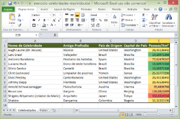
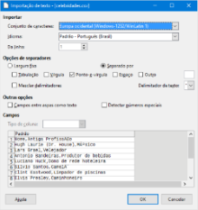
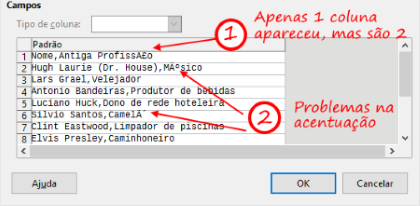
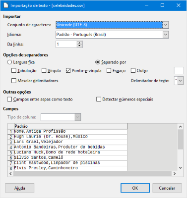
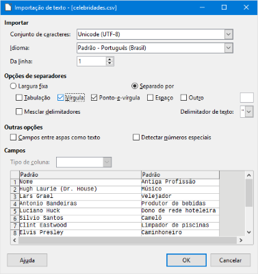
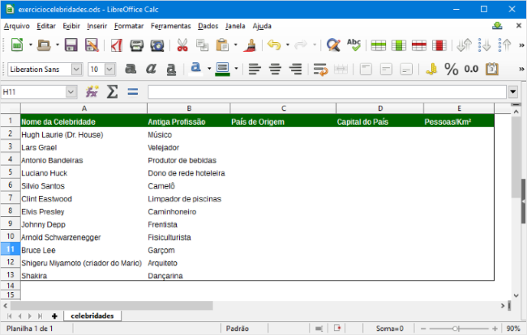
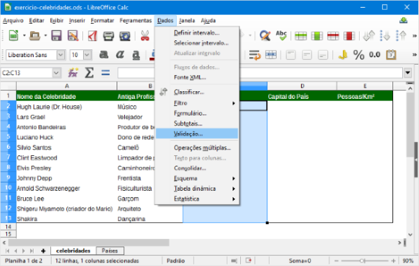
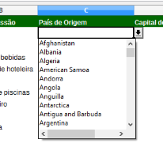
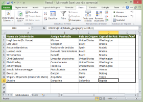

## Guia Planilhas Eletrônicas - 4

- Assunto: **Planilhas eletrônicas**: Calc
- Objetivos:
  1. Conectar a **fontes de dados** diversas
  1. Usar **validação** de dados
  1. Usar **formatação condicional** de células
  1. Praticar o uso de funções

---
## Enunciado

- Você deve criar a planilha abaixo que reune informações sobre **o que algumas
  celebridades faziam antes de se tornar famosas** e também algumas informações
  sobre seu **país de origem**
- Você deve seguir os passos que serão descritos nos próximos _slides_

  

---
## Motivação: Conectar a fontes de dados

- Hoje vamos construir uma planilha no LibreOffice Calc que **acessa dados de
  outros arquivos**
  - Digamos que você precisa de uma coluna em sua planilha para dizer o país e
    a capital onde uma pessoa nasceu
    - Você pode digitar isso você mesmo
    - Mas, se você já tiver essa informação em outro local do seu computador,
      é mais adequado simplesmente reutilizar

---
## Exercício - Parte **1**

- Baixar um arquivo texto que tem informações sobre algumas celebridades
  - [celebridades.csv](attachments/guia-planilha-eletronica-4/celebridades.csv)
- 
  Abra esse arquivo **usando um editor de texto simples**, como o `Notepad`,
  o `Notepad++` ou o `gedit`
  - Repare o formato do arquivo: são apenas textos, separados por vírgula
  - O formato <abbr title="Comma-separated values">`CSV`</abbr> é um formato
    de arquivo comum para armazenar dados e ele é muito simples
  - Tipicamente, o separador é a vírgula, mas outros caracteres podem ser
    usados (como "`;`" ou "`TAB`")

---
## Exercício - Parte 1 (cont.)

- Abra o arquivo `celebridades.csv` usando o Calc
  - 
    Um assistente de importação será aberto. Aqui, devemos ajudar o Calc a
    entender como o arquivo `CSV` está configurado
    - Repare que há dois "problemas":

      


---
## Exercício - Parte 1 (cont.)

- Para corrigir o problema 2 (<u>acentos estranhos</u>):
  1. 
     O Calc precisa saber qual é a **codificação** do texto do arquivo
    `celebridades.csv`
  1. Selecione a codificação **`Unicode (UTF-8)`** (8 bits por caractere)
     e repare que os acentos foram corrigidos

---
## Exercício - Parte 1 (cont.)

- Para corrigir o problema 1 (<u>apenas 1 coluna</u>):
  1. 
    O Calc precisa saber qual é o **caractere delimitador** das informações
    - No arquivo `celebridades.csv`, a <u>vírgula</u> está delimitando
      as colunas
  1. Selecione o caractere que delimita informações
  1. Clique em `Ok` para confirmar

---
## Exercício - Parte 1 (cont.)

- 
  **Salvar <u>como</u>** um novo arquivo no Calc com o nome `exercicio-celebridades.ods`

---
## Exercício - Parte **2**

- Altere a primeira linha para conter um cabeçalho das colunas
  1. Nas células:
    - A1, escreva "Nome da Celebridade"
    - B1, escreva "Antiga Profissão"
    - C1, escreva "País de Origem"
    - D1, escreva "Capital do País"
    - E1, escreva "Pessoas/Km²"

---
## Exercício - Parte 2 (cont.)

1. Formate a planilha de forma que ela se pareça com a figura abaixo

   

---
## Motivação: mais sobre fontes de dados externas

- Agora, precisamos de uma lista de países, capitais e informação de
  habitantes por km² de cada país para terminarmos de preencher a planilha
- Para isso, vamos **usar um banco de dados que contém essas informações**

---
## Exercício - Parte **3**

- Baixe outro arquivo CSV disponibilizado pelo professor que tem
  informações sobre países:
  - [`countries.csv`](attachments/guia-planilha-eletronica-4/countries.csv)
- Agora, **vamos abrir o arquivo** `countries.csv` e trazer seu conteúdo para
  nossa planilha `exercicio-celebridades.ods`
  1. Crie uma segunda aba com nome "Países"
  1. Abra o arquivo `countries.csv`, fazendo a **devida configuração do
    arquivo CSV**
  1. Uma vez aberto, copie o conteúdo de `countries.csv` e cole-o na aba
    "Países" do arquivo `exercicio-celebridades.ods`

---
## Recapitulando

- No momento agora temos uma planilha com informações sobre as celebridades
  (parcialmente preenchida) e outra planilha com dados sobre países
- Agora, **vamos preencher a coluna "País de Origem" da planilha
  "Celebridades"**
- Contudo, já que temos a informação de todos os países, **em vez de digitar**
  os países nas colunas, **queremos <u>selecionar o país de uma lista</u>,
    para facilitar**
  - Veja a seguir como conseguir isso na parte 4 do exercício

---
## Exercício - Parte **4**

- Vamos usar um recurso do Calc chamado **validação de dados** para restringir
  os valores que podemos colocar em uma célula
  - Mais especificamente, vamos falar para o Calc que a coluna
    "País de Origem" aceita apenas os nomes dos países

1. Selecione as células `C2:C13` (da coluna "País de Origem" da planilha
   "Celebridades")

---
## Exercício - Parte 4 (cont.)

1. Na aba "Dados", seção "Ferramentas de Dados", clique no botão "Validação
   de Dados"

   

---
## Exercício - Parte 4 (cont.)

1. 
   Uma janela aparecerá. Nela, devemos selecionar como queremos restringir os
   valores a serem digitados nas células selecionadas
   1. Na janela, selecione que você deseja **permitir um "Intervalo de Células"**
   1. Além disso, selecione a "Fonte" dos dados da lista como as células
      que contêm nomes de países na planilha "Países" (`$Países.$A$2:$A$248`)

---
## Exercício - Parte 4 (cont.)

- Continuando... (após clicar em "Ok")
  1. Repare que agora, nas células da coluna "País de Origem", existe um botão
     que dá acesso a uma lista de países:

     
  1. Agora, preencha o país de origem de cada celebridade
    - Você pode consultar o Google para aquelas que não souber, ou simplesmente
      selecionar qualquer país

---
## Recapitulando

- Agora podemos selecionar o nome do país (em inglês, mas tudo bem) para cada
  celebridade
- Contudo, também precisamos saber qual é a capital dos países para colocar na
  coluna "Capital do País"
- A nossa planilha "Países" tem a relação de capital de cada país, então
  podemos reutilizá-la
  - Mas, vamos fazer isso sem precisar escrever as capitais nós mesmos.
    Veja como fazer isso na parte 5

---
## Exercício - Parte **5**

- Para preencher as células da coluna "Capital do País" de forma automática,
  vamos usar uma função do Excel chamada <abbr title="Procura Vertical">`PROCV`</abbr>
1. Selecione a primeira célula da coluna "Capital do País": `D2`
   - A função `PROCV` procura, em uma tabela, o valor de uma outra coluna
   - Ela precisa de 3 parâmetros:
     ```
     =PROCV(valor_procurado; matriz_tabela; número_coluna)
     ```

---
## Exercício - Parte 5 (cont.)

- Para usar a função `PROCV` na célula `D2` e buscar a capital do país que
  está selecionado na célula `C2`:
  ```
  =PROCV(C2;Países.$A$1:$K$248;4)
  ```
- Veja como a planilha deve ficar:
  

---
## Exercício - Parte 5 (cont.)

1. Copie a fórmula que você criou para a célula `D2` para `D3`, `D4` e todas as
   outras células da coluna "Capital do País"
   - Você pode selecionar a célula `D2` e arrastar o quadrado/triângulo do
     canto inferior direito para as outras células (até `D13`)

     

---
## Exercício - Parte **6**

1. Usando a mesma função (`PROCV`), preenha a coluna Pessoas/Km² usando as
   colunas "Population" e "Area" da planilha "Países"
   - Você vai precisar fazer algo como:
     ```
     =PROCV(...)/PROCV(...)
     ```
  - Como deve ficar a planilha:
    

<!--
## Exercício - Parte **7**

- Agora vamos mostrar quais países são mais populosos (alto número de pessoas
  por km²)
- Vamos usar uma ferramenta de "Formatação Condicional"


## Exercício - Parte 7 (cont.)

- o Excel pode formatar células de forma diferente dependendo do valor da
  célula
  1. Selecione as células `E2:E13` (coluna "Pessoas/Km²")
  1. Selecione a opção de formatação condicional como na imagem abaixo:

     

-->
---
## Finalizando...

1. Entregar **via Moodle** no horário **desta aula**
