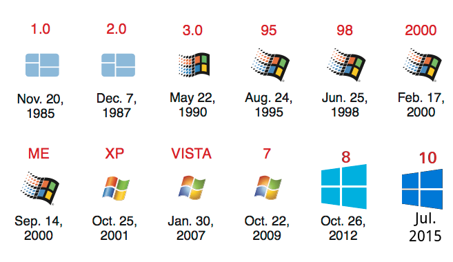

## Guia 12

- Assunto: **Sistemas Operacionais**
- Objetivo:
  1. Descrever as funções de um sistema operacional
  1. Conhecer os sistemas operacionais de computadores pessoais mais comuns

---
<!--
backdrop: os-icons
-->

# Sistema Operacional (**SO**)

---
## Por que precisamos de um SO?

- Um computador é formado por _hardware_ e _software_
- Para que programas possam ser executados pelo processador, eles precisam
  usar os diversos recursos do computador:
  1. Usar a Memória RAM (memória primária);
  1. Carregar/escrever arquivos no disco rígido (memória secundária);
  1. Exibir informações em um monitor (dispositivo saída), etc.
- Contudo, os **programas tradicionais** não conseguem **se comunicar com o _hardware_**
- Além disso, o que acontece se dois programas precisam usar o mesmo recurso (e.g., o teclado)
  ao mesmo tempo?
  - Precisamos de alguém para **gerenciar a utilização de recursos**...

---
## **Definição** de um SO

  Um sistema operacional é um conjunto de programas que se encontra **entre o _software_
  aplicativo e o _hardware_**, como um intermediário; é o _software_ fundamental que
  **controla** o acesso a todos os **recursos de _hardware_ e _software_**.

- O **_kernel_** (núcleo) é a parte mais importante de um SO
  - É um **programa residente** (está sempre na RAM, em execução)
  - Controla todo o sistema e, quando necessário, carrega da memória secundária
    para a primária outros programas (não residentes)

---
## Funções de um SO

1. **Alocar recursos**
  - Processo de atribuição de recursos do computador a determinados programas
  - Assim que um programa é finalizado, os recursos que ele usava são liberados
1. **Carregar e escalonar** (agendar) programas de usuário (não residentes)
1. Estabelecer a **interface com o usuário**
  - Via linha de comando
  - Via interface gráfica

---
## Tipos de **interfaces com usuário**

  <section style="background-color: rgba(58, 58, 58, 0.83); color: white;">
    <h3>Linha de comando</h3>
    
    
Esta é uma interface de linha de comando.

  </section>
  <section style="background-color: rgba(88, 230, 69, 0.83)">
    <h3>Interface Gráfica</h3>
    
    
Esta é uma interface gráfica (<abbr title="Graphical User Interface">GUI</abbr>, em inglês).

  </section>

---
# SOs mais comuns para estações de trabalho

---
<!--
backdrop: os-windows
-->

<h1 style="margin-top: 2em">Windows</h1>

---
## Windows

- Criado (1985) por **Bill Gates e Paul Allen** na empresa **Microsoft**
- É um produto comercial e devido à sua estratégia de marketing, vem
  instalado em grande parte dos computadores pessoais vendidos
- Inicialmente, o Windows era apenas uma interface gráfica para o SO MS-DOS
  - A partir do Windows 95, ele se tornou um SO
  - Hoje em dia, existe um simulador do MS-DOS dentro do Windows

---
## Versões do Windows por ano

---
<!--
backdrop: os-unix
-->

# Unix

---
## Unix

- <figure class="portrait right">
    
  </figure>
  Criado (1971) por Ken Thompson e Dennis Ritchie (criador da linguagem C) na empresa de
  telecomunicações estadounidense AT&amp;T
- Sistema multiusuário, inicialmente com apenas interface de linha de comando
  - Atualmente, existem interfaces gráficas para o Unix
- Foi distribuído para várias universidades e os alunos acostumaram a usá-lo
- Hoje em dia, usado em computadores servidores de Internet

---
<!--
backdrop: os-linux
-->

# Linux

---
## Linux

- <figure class="portrait right">
    
  </figure>
  Criado (1991) por Linus Torvalds (vulgo Harry Potter), então estudante
  na Finlândia, baseado no Unix
- Extremamente estável (assim como Unix)
- O código fonte do _kernel_ foi disponibilizado público e gratuitamente
  - A isso é dado o nome de **código aberto** (ou _opensource_)
  - Qualquer pessoa pode baixar o código e fazer modificações
- Possui **várias opções de interface gráfica**. Por exemplo:
  <ul class="multi-column-list-3">
    <li>Gnome</li>
    <li>KDE</li>
    <li>Unity</li>
    <li>Cinnamon</li>
  </ul>

---
## Linux (**distribuições**)

- Como Linus inicialmente disponibilizou apenas o _kernel_,
  algumas empresas e organizações criaram os outros pedaços que faltavam no SO
  e os disponibilizaram (a grande maioria em **código aberto**)
  - Ao conjunto de **_kernel_ + outras coisas** deu-se o nome de **distribuição**
- Exemplos de distribuição do linux:
  1. [Debian](https://www.debian.org/index.pt.html)
    - Mantido por um grupo de programadores voluntários
    - Extremamente robusto e estável
  1. [Ubuntu](http://ubuntu-br.org/)
    - Gratuito, baseado na distribuição Debian
    - Mantido pela empresa Canonical Ltd e pela Ubuntu Foundation

---
## Linux (distribuições)

1. [Fedora](https://getfedora.org/)
  - Produzido pela empresa [Red Hat](http://www.redhat.com/en), é gratuito, mas
    tem um plano de suporte que é pago
1. Kurumin
  - Distribuição brasileira (existem várias outras)
  - Criada pelos programadores do site **guiadohardware**
  - Descontinuada :(
1. BrDesktop
  - Também brasileira e baseado no Debian

---
<!--
backdrop: os-mac
-->

# Mac OS

---
## Mac OS (ou OS X)

- Criado (1984) a mantido pela empresa Apple Inc.
- Foi o segundo SO a possuir uma interface gráfica
  - O primeiro foi protótipo Alto, da Xerox
- Criou o conceito de **área de trabalho** (_desktop_), em uma
  referência a uma mesa de escritório
- A partir da versão 10, passou a ser baseado no Unix

---
# Exercícios no Moodle
