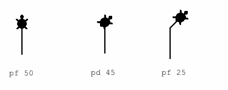

# Informática - REDES

- Disciplina: **Laboratório de Fundamentos de Informática**
- Professor: **[Flávio Coutinho](mailto:coutinho@decom.cefetmg.br)**

---
## Aula 0

- Assunto: Introdução à disciplina
- Objetivos:
  1. Conhecer os conceitos básicos de informática de forma a possibilitar
     o uso de computadores em rotinas básicas e facilitar o aprendizado
  1. Familiarizar com
     - Evolução e fundamentos da informática
     - Conceitos de _hardware_
     - Ferramentas e aplicação de informática
     - Diversos tipos de _software_
     - Segurança da informação

---
# Conteúdo Programático

---
## UNIDADE 1. **INTRODUÇÃO AOS COMPUTADORES E À INFORMÁTICA**

1. Definição de Informática
1. Breve História dos Computadores
1. Funções Básicas do Computador

---
## UNIDADE 2. **REPRESENTACÃO DE DADOS E SISTEMAS DE NUMERACÃO**

1. Bits e Bytes
1. Bases de Numeração: Representação Decimal, Binária, Octal e Hexadecimal
1. Conversões de Números entre Bases
1. Aritmética Binária
1. Tipos de Dados e Suas Representações
1. Tabela ASCII

---
## UNIDADE 3. **CONCEITOS DE SISTEMA OPERACIONAIS**

1. Noções básicas de uso de Sistemas Operacionais
1. Conceitos de Diretório, Arquivo e File System
1. Comandos Básicos e Execução de Processos
1. Sistemas Operacionais MsDos, Windows e Linux

---
## UNIDADE 4. **INTERNET**

1. Conceitos Básicos de Redes de Computadores e Internet
1. Conceito de email: manipulação e boas práticas, o email como
   ferramenta de trabalho
1. Boas maneiras na Internet
1. A Internet como ferramenta de trabalho

---
## UNIDADE 5. **UTILIZANDO O COMPUTADOR COM SEGURANÇA**

1. Boas práticas de segurança
1. _Backup_
1. Virus, _worms_, _spy/adwares_, spams, etc
1. Aspectos legais da Internet

---
## UNIDADE 6. **PROCESSAMENTO DE TEXTO**

1. Processadores de texto disponíveis no mercado
1. Normas técnicas para formatação de trabalho científico
1. Tipos de Documentos e Modelos
1. Recursos avançados do Word
1. Tabelas, autoforma
1. Inserção de Objetos: Office Art, Figuras e Gráficos
1. Mala direta
1. Referência cruzada e índices

---
## UNIDADE 7. **PLANILHAS ELETRÔNICAS**

1. Planilhas eletrônicas disponíveis no mercado
1. Conceitos de arquivo, planilha e Célula
1. Criação de Fórmulas
1. Utilização de Funções
1. Formatação de células (formatação condicional).
1. Elaboração de Gráficos
1. Validação de Dados
1. Subtotais
1. Transferência de Informação entre o Excel e o Word
1. Acesso a fonte de dados externos via ODBC
1. Configuração de Páginas e Impressão

---
## UNIDADE 8 – **PROGRAMAS DE APRESENTAÇÕES**

1. Orientações de Apresentação de conteúdos
1. Programas de Apresentações Disponíveis no Mercado
1. Tipos de Apresentação
1. Estruturação da Apresentação e Utilização de Modelos
1. Construção da Apresentação
1. Utilização de Fundos
1. Tipos de Slides
1. Inserção e Formatação de texto
1. Modos de Visualização
1. Potencialidades Multimídias
1. Gráficos, Tabelas e Organogramas
1. Impressão de Apresentações e Material de Apoio

---
## UNIDADE 9. **COMPONENTES DO COMPUTADOR**

1. Dispositivos de Entrada e de Saída
1. Unidade de Processamento
1. Dispositivos de Armazenamento
1. Tipos de Computadores
1. Componentes
1. Gabinete
1. Processadores e ventilação
1. Memória
1. Placa mãe
1. Vídeo, Rede, Modem
1. Fontes de Alimentação
1. Portas de Comunicação

---
# Critérios de avaliação

---
## 4 Bimestres

- 1º Bimestre: 20 pontos
- 2º Bimestre: 30 pontos
- 3º Bimestre: 20 pontos
- 4º Bimestre: 30 pontos

---
## Atividades Avaliativas do **1º bimestre**

- (4) Participação em sala de aula
- (8) Entrega das atividades em sala
  - ~1 ponto por aula
- (8) Prova

---
# Atividade de hoje

---

## **Logo**

1. Instale o programa FMS Logo.
  - [Link para _download_ no sourceforge](http://sourceforge.net/projects/fmslogo/)
  - [Link para _download_ local](attachments/fmslogo-6.32.0.exe)
1. Usando os comandos do logo (veja os slides adiante), escreva  na tela:
  - O seu primeiro ou
  - O seu sobrenome ou
  - O nome do seu cachorro.
1. Poste o resultado (a imagem) e o código produzido no Moodle.
  - Caso o Moodle ainda não tenha sido ativado, envie os dois arquivos por email para 
    [coutinho@decom.cefetmg.br](mailto:coutinho@decom.cefetmg.br) **com o assunto** "aula-0 sobre logo"

---
## Comandos no logo (1/2)

1. **Andar para frente**
   - `parafrente nº` ou **`pf nº`**
   - Faz com que a tartaruga ande para frente (no sentido que ela estiver apontando) 
     o número de passos digitado (`nº`).
1. **Andar para trás**
   - `paratrás nº` ou **`pt nº`**
   - Faz com que a tartaruga ande para trás (no sentido oposto que
     ela estiver apontando) o número de passos digitado (`nº`).
1. **Virar para a direita**
   - `paradireita nº` ou **`pd nº`**
   - Gira a tartaruga para a direita o número de graus (`nº`).

---
## Comandos no logo (2/2)

1. **Virar para a esquerda**
   - `paraesquerda nº` ou **`pe nº`**
   - Gira a tartaruga para a esquerda o número de graus igual a `nº`.
1. **Saltar**
   - `usenada` ou **`un`**
   - Movimenta a tartaruga sem riscar
1.  **Riscar**
   - `uselápis` ou **`ul`**
   - Movimenta a tartaruga deixando um rastro

---
## Resultado do professor

