# Informática - REDES

- Disciplina: **Laboratório de Fundamentos de Informática**
- Professor: **[Flávio Coutinho](mailto:coutinho@decom.cefetmg.br)**

---
## Guia **17**

- Assunto: **Planilhas eletrônicas**: Excel
- Objetivos:
  1. Conectar a fontes de dados diversas
  1. Usar validação de dados
  1. Usar formatação de células condicional
  1. Praticar o uso de funções

---
## Enunciado

- Você deve criar a planilha abaixo que reune informações sobre **o que algumas
  celebridades faziam antes de se tornar famosas** e também algumas informações
  sobre seu **país de origem**
- Você deve seguir os passos que serão descritos nos próximos _slides_

  

---
## Motivação: Conectar a fontes de dados

- Hoje vamos construir uma planilha no Microsoft Excel que acessa dados de
  outros arquivos.
  - Digamos que você precisa de uma coluna em sua planilha para dizer o país e
    a capital onde uma pessoa nasceu
    - Você pode digitar isso você mesmo
    - Mas, se você já tiver essa informação em outro local do seu computador,
      é mais adequado simplesmente reutilizar

---
## Exercício - Parte **1**

- Baixar um arquivo texto que tem informações sobre algumas celebridades
  - [celebridades.csv](attachments/guia17/celebridades.csv)
- 
  Abra esse arquivo **usando um editor de texto simples**, como o `Notepad` ou
  o `Notepad++`
  - Repare o formato do arquivo: são apenas textos, separados por vírgula
  - O formato <abbr title="Comma-separated values">`CSV`</abbr> é um formato
    de arquivo comum para armazenar dados e ele é muito simples
  - Tipicamente, o separador é a vírgula, mas outros caracteres podem ser
    usados

---
## Exercício - Parte 1 (cont.)

- Criar um arquivo no Excel e salvá-lo com o nome `guia17.xlsx`
- Agora, você deve importar as informações do arquivo `celebridades.csv` para
  dentro do seu arquivo `guia17.xlsx`:
  1. Na aba "Dados", na seção "Obter Dados Externos", clique no botão
     "De Texto"
     
  1. Uma janela para seleção de arquivo abrirá. Selecione `celebridades.csv`

---
## Exercício - Parte 1 (cont.)

- Continuando (após selecionar `celebridades.csv`)...
  1. Um assistente de importação será aberto. Aqui, devemos ajudar o Excel a
     entender como o arquivo `CSV` está configurado
  1. Faça a configuração de acordo com o que você perceba do arquivo, de forma
     que faça sentido para você

     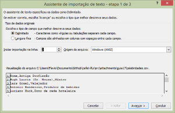

---
## Exercício - Parte 1 (cont.)

- Continuando (após clicar em "Avançar")...
  1. Na segunda tela do assistente, o Excel pergunta qual é o **caractere
     delimitador** das informações
  1. Selecione o caractere que delimita informações no arquivo
     `celebridades.csv`

     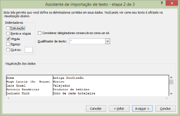

---
## Exercício - Parte 1 (cont.)

- Continuando (após clicar em "Avançar")...
  1. O Excel agora sabe quantas colunas (2) o arquivo `CSV` tem. Agora, ele
     precisa saber o tipo de informação em cada coluna (texto, número, data
     etc.)
  1. Como as duas colunas contém apenas texto, selecione o **tipo de dados**
     apropriado **para cada uma**

     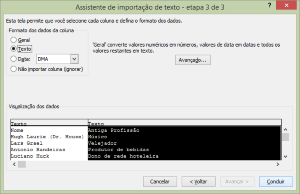

---
## Exercício - Parte 1 (cont.)

- Continuando (após clicar em "Concluir")
  1. 
     Uma pequena janela abrirá perguntando onde quer colocar os dados
     importados
     - Selecione a primeira célula da primeira planilha. O resultado é
       mostrado abaixo:

  1. Renomeie a planilha "Plan1" para "Celebridades"

---
## Exercício - Parte **2**

- Vamos criar uma nova linha para conter um cabeçalho das colunas
  1. Crie uma nova linha acima da linha 1
  1. Nas células:
    - A1, escreva "Nome da Celebridade"
    - B1, escreva "Antiga Profissão"
    - C1, escreva "País de Origem"
    - D1, escreva "Capital do País"
    - E1, escreva "Pessoas/Km²"

---
## Exercício - Parte 2 (cont.)

1. Formate a planilha de forma que ela se pareça com a figura abaixo

   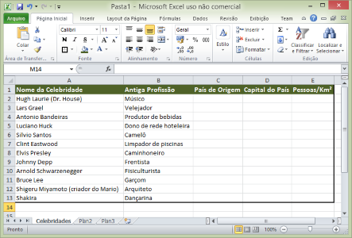

---
## Motivação: mais sobre fontes de dados externas

- Agora, precisamos de uma lista de países, capitais e informação de
  habitantes por km² de cada país para terminarmos de preencher a planilha
- Para isso, vamos **usar um banco de dados que contém essas informações**

---
## Exercício - Parte **3**

- Baixe um banco de dados disponibilizado pelo professor que tem
  informações sobre países:
  - [`geography.accdb`](attachments/guia17/geography.accdb)
- Abra esse arquivo **usando um editor de texto puro**, como o `Notepad++`
  - Diferente de um arquivo `CSV`, um arquivo de banco de dados no formato
    `ACCDB` é bastante complexo e codificado de forma binária
    - Daí, não conseguimos extrair informação usando um editor de texto simples
- Para visualizar este arquivo, precisamos do programa **Microsoft Access**,
  que é **a ferramenta do pacote Office que usamos para criar bancos de dados**

---
## Exercício - Parte 3 (cont.)

- Agora, vamos importar algumas informações do arquivo `geography.accdb`
  para nossa planilha
  1. Altere o nome da segunda planilha para "Países", em vez de "Plan2"
  1. Exclua a terceira planilha (Plan3)
  1. Na aba "Dados", na seção "Obter Dados Externos", selecione "Do Access"

---
## Exercício - Parte 3 (cont.)

1. Selecione o arquivo que você baixou (`geography.accdb`)
  - O arquivo `geography.accdb`, assim como outros tipos de bancos de dados,
    organiza os dados em tabelas
  - Uma nova janela será aberta, perguntando que tabela do arquivo
    `geography.accdb` você deseja importar

    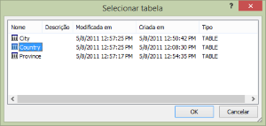
  - Selecione a tabela `Country` (país, em inglês) e clique "Ok"

---
## Exercício - Parte 3 (cont.)

- Continuando (depois de selecionar "Ok")
  1. Uma nova janela abrirá, perguntando se você quer importar os dados
     dos países como uma tabela, uma tabela dinâmica ou uma tabela dinâmica
     e um gráfico
     - Escolha apenas "Tabela" e selecione a primeira célula da planilha
       "Países"

       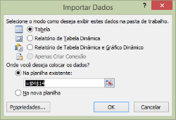

---
## Exercício - Parte 3 (cont.)

- A segunda planilha se parecerá com a figura abaixo:

  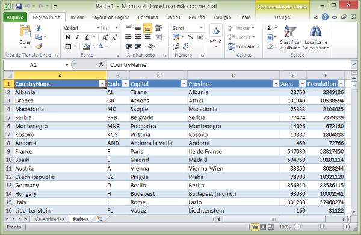

---
## Recapitulando

- No momento agora temos uma planilha com informações sobre as celebridades
  (parcialmente preenchida) e outra planilha com dados sobre países
- Agora, queremos preencher a coluna "País de Origem" da planilha "Celebridades"
- Contudo, já que temos a informação de todos os países, **em vez de digitar**
  os países nas colunas, vamos selecionar o país de uma lista, para facilitar
  - Veja a seguir como conseguir isso na parte 4 do exercício

---
## Exercício - Parte **4**

- Vamos usar um recurso do Excel chamado **validação de dados** para restringir
  os valores que podemos colocar em uma célula
  - Mais especificamente, vamos falar para o Excel que a coluna
    "País de Origem" aceita apenas os nomes dos países
1. Selecione as células C2:C13 (da coluna "País de Origem")

---
## Exercício - Parte 4 (cont.)

1. Na aba "Dados", seção "Ferramentas de Dados", clique no botão "Validação
   de Dados"

   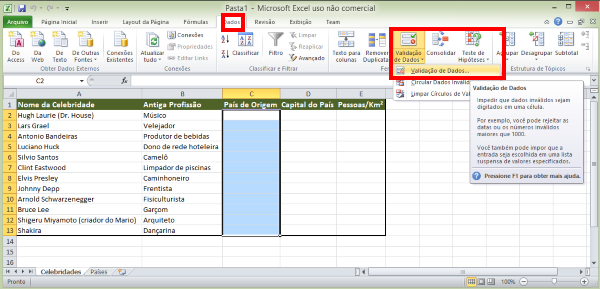

---
## Exercício - Parte 4 (cont.)

1. Uma janela aparecerá. Nela, devemos selecionar como queremos restringir os
   valores a serem digitados nas células selecionadas

   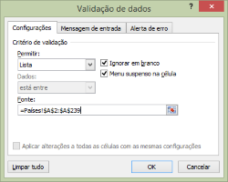
   1. Na janela, selecione que você deseja permitir uma "Lista" de valores
   1. Além disso, selecione a "Fonte" dos dados da lista como as células
      que contêm nomes de países na planilha "Países" (=Países!A2:A239)

---
## Exercício - Parte 4 (cont.)

- Continuando... (após clicar em "Ok")
  1. Repare que agora, nas células da coluna "País de Origem", existe um botão
     que dá acesso a uma lista de países:

     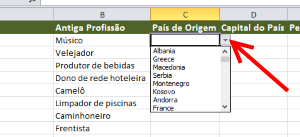
  1. Agora, preencha o país de origem de cada celebridade
    - Você pode consultar o Google para aquelas que não souber, ou simplesmente
      selecionar qualquer país

---
## Recapitulando

- Agora podemos selecionar o nome do país (em inglês, mas tudo bem) para cada
  celebridade
- Contudo, também precisamos saber qual é a capital dos países para colocar na
  coluna "Capital do País"
- A nossa planilha "Países" tem a relação de capital de cada país, então
  podemos reutilizá-la
  - Mas, vamos fazer isso sem precisar escrever as capitais nós mesmos.
    Veja como fazer isso na parte 5

---
## Exercício - Parte **5**

- Para preencher as células da coluna "Capital do País" de forma automática,
  vamos usar uma função do Excel chamada <abbr title="Procura Vertical">`PROCV`</abbr>
1. Selecione a primeira célula da coluna "Capital do País": `D2`
   - A função `PROCV` procura, em uma tabela, o valor de uma outra coluna
   - Ela precisa de 3 parâmetros:
     ```
     =PROCV(valor_procurado; matriz_tabela; número_coluna)
     ```

---
## Exercício - Parte 5 (cont.)

- Para usar a função `PROCV` na célula `D2` e buscar a capital do país que
  está selecionado na célula `C2`:
  ```
  =PROCV(C2; Tabela_geography.accdb; 3)
  ```
- Veja como a planilha deve ficar:

  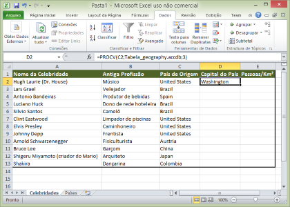

---
## Exercício - Parte 5 (cont.)

1. Copie a fórmula que você criou para a célula `D2` para `D3`, `D4` e todas as
   outras células da coluna "Capital do País"
   - Você pode selecionar a célula `D2` e arrastar o quadrado/triângulo do
     canto inferior direito para as outras células (até `D13`)

     

---
## Exercício - Parte **6**

1. Usando a mesma função (`PROCV`), preenha a coluna Pessoas/Km² usando as
   colunas "Population" e "Area" da planilha "Países"
   - Você vai precisar fazer algo como:
     ```
     =PROCV(...)/PROCV(...)
     ```
  - Como deve ficar a planilha:

    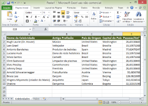

---
## Exercício - Parte **7**

- Agora vamos mostrar quais países são mais populosos (alto número de pessoas
  por km²)
- Vamos usar uma ferramenta de "Formatação Condicional"

---
## Exercício - Parte 7 (cont.)

- o Excel pode formatar células de forma diferente dependendo do valor da
  célula
  1. Selecione as células `E2:E13` (coluna "Pessoas/Km²")
  1. Selecione a opção de formatação condicional como na imagem abaixo:

     

---
## Finalizando...

1. Entregar **via Moodle** no horário **desta aula**
